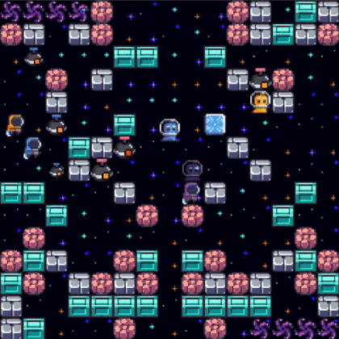

# Bomberland Project Report

 | 

This repository hosts the web report for our project on **Multi-Agent Reinforcement Learning** in the [Bomberland](https://www.gocoder.one/bomberland) environment.

The project focuses on training multiple agents using attention-based policy networks, optimized with PPO, GAE, LSTM and self-play strategies.

- 📄 [View Project Report Website](https://guochenmeinian.github.io/bomberland_rl_report/)
- 📂 [View Code Repository](https://github.com/guochenmeinian/bomberland_rl_agents.git)

## About

[Bomberland](https://www.gocoder.one/bomberland) is a multi-agent AI competition inspired by the classic console game Bomberman.

Teams build intelligent agents using strategies from tree search to deep reinforcement learning. The goal is to compete in a 2D grid world collecting power-ups and placing explosives to take your opponent down.

## Acknowledgments
Parts of this project page were adopted from the [Nerfies](https://nerfies.github.io/) page.

## Website License
 This work is licensed under a <a rel="license" href="http://creativecommons.org/licenses/by-sa/4.0/">Creative Commons Attribution-ShareAlike 4.0 International License</a>.
